```mermaid
erDiagram

user {
    CHAR id PK "User ID"
    VARCHAR username "User nickname"
    VARCHAR password "User password"
    INT role_id "Role ID"
    DATETIME register_time "Registration time"
    INT sex "Gender"
    VARCHAR head_pic "Avatar"
    CHAR phone "Phone number"
    VARCHAR info "Introduction"
}

article {
    CHAR id PK "Article ID"
    VARCHAR title "Title"
    CHAR user_id FK "Author User ID"
    VARCHAR summary "Summary"
    LONGTEXT content_html "Content (HTML)"
    LONGTEXT content_markdown "Content (Markdown)"
    DATETIME create_time "Creation time"
    DATETIME update_time "Update time"
    INT type "Type"
    INT view_num "Views"
    INT collect_num "Collects"
    INT like_num "Likes"
    INT comment_num "Comments"
    INT state "Status"
    CHAR category_id FK "Category ID"
    INT top "Is pinned"
    INT official "Is official"
    INT essence "Is featured"
}

category {
    CHAR id PK "Category ID"
    VARCHAR name "Category name"
    INT sort "Sort order"
}

tag {
    CHAR id PK "Tag ID"
    VARCHAR name "Tag name"
}

tag_item {
    CHAR id PK "Tag item ID"
    CHAR tag_id FK "Tag ID"
    CHAR article_id FK "Article ID"
}

attention {
    CHAR id PK "Follow record ID"
    CHAR from_id FK "Follower User ID"
    CHAR to_id FK "Followed User ID"
    DATETIME create_time "Follow time"
}

collect {
    CHAR id PK "Collect record ID"
    CHAR user_id FK "Collector User ID"
    CHAR article_id FK "Collected Article ID"
    DATETIME create_time "Collect time"
}

comment {
    CHAR id PK "Comment ID"
    CHAR from_id FK "Commenter User ID"
    CHAR to_id FK "Replied User ID"
    CHAR parent_id FK "Parent Comment ID"
    CHAR article_id FK "Commented Article ID"
    VARCHAR content "Content"
    INT type "Type"
    INT pick "Is accepted"
    DATETIME create_time "Comment time"
}

likes {
    CHAR id PK "Like ID"
    CHAR user_id FK "User ID"
    CHAR article_id FK "Liked Article ID"
    DATETIME create_time "Like time"
}

user ||--o{ article : writes
user ||--o{ collect : collects
user ||--o{ likes : likes
user ||--o{ comment : comments
user ||--o{ attention : follows

category ||--o{ article : categorizes

article ||--o{ collect : collected
article ||--o{ likes : liked
article ||--o{ comment : commented
article ||--o{ tag_item : tagged

tag ||--o{ tag_item : tags

comment ||--o{ comment : replies
```

# Blog-Forum-System

A full-stack blog and forum platform featuring user registration, article posting, commenting, liking, bookmarking, social follows, and a real-time weather widget powered by WeatherAPI.com. Includes a public React site, an admin React dashboard, and a Spring Boot + MyBatis backend.

---

## Table of Contents

- [Overview](#overview)  
- [Features](#features)  
- [Architecture](#architecture)  
- [Technology Stack](#technology-stack)  
- [Prerequisites](#prerequisites)  
- [Setup](#setup)  
  - [1. Clone the Repository](#1-clone-the-repository)  
  - [2. Database Initialization](#2-database-initialization)  
  - [3. Configure Backend](#3-configure-backend)  
  - [4. Configure Frontends](#4-configure-frontends)  
  - [5. Run Server](#5-run-server)  
  - [6. Run Public Site](#6-run-public-site)  
  - [7. Run Admin Dashboard](#7-run-admin-dashboard)  
- [Directory Structure](#directory-structure)  
- [License](#license)  

---

## Overview

Blog-Forum-System is a **modern** full-stack application that lets users and administrators interact in a blogging/forum environment. The public site allows visitors to:

- Sign up, log in, and manage profiles  
- Create and edit markdown-based articles  
- Comment with nested replies, like, bookmark, and follow authors  
- See real-time weather information based on their location  

Administrators use a dedicated React dashboard to moderate content, manage users, and view site analytics.

---

## Features

- **User Authentication & Authorization**  
  - Registration, login, JWT-based sessions, role-based access (user vs. admin).  

- **Article & Forum Management**  
  - Write, edit, delete, and view articles in Markdown.  
  - Tag & category system for content organization.  
  - Rich editor with image upload support.  

- **Social Interactions**  
  - Commenting with nested replies.  
  - Like and bookmark (collect) articles.  
  - Follow/unfollow authors to build a network.  

- **Real-Time Weather Module**  
  - Uses WeatherAPI.com’s `/current.json` endpoint.  
  - On page load, obtains user geolocation (lat/lon) via browser API.  
  - Displays temperature, condition, and icon in the header.  

- **Admin Dashboard**  
  - React dashboard for content moderation, user management, and basic reporting.  
  - Search, filter, and paginate users, articles, comments.  

- **Responsive & Themed UI**  
  - use AntDesign components
---

## Architecture

This repository contains three main modules:

1. **Server** (`/server`)  
   - Spring Boot 2.2.5 REST API running on port **8081** by default.  
   - MyBatis for ORM; PageHelper for pagination.  
   - Alibaba Druid connection pool; FastJSON for JSON serialization.  
   - Redis for caching sessions and hot-data.  

2. **Web** (`/web`)  
   - Public React app (Create React App) on port **3000**.  
   - Fetches from backend APIs; handles user auth, article views, interactions, and weather widget.  

3. **Admin** (`/admin`)  
   - React dashboard (Create React App) on port **3001**.  
   - Uses the same APIs with elevated permissions for admin endpoints.

---

## Technology Stack

- **Backend**  
  - Java 8, Spring Boot, MyBatis, PageHelper, Druid, FastJSON, Redis, MySQL 8.0  

- **Frontend**  
  - React (Create React App), JavaScript (ES6+), SCSS  

- **Weather Integration**  
  - [WeatherAPI.com](https://www.weatherapi.com/) for real-time weather via `/current.json` (latitude/longitude)  

- **Build & Dev Tools**  
  - Maven, npm, Webpack, Babel  

---

## Prerequisites

- **Java 8+** & **Maven**  
- **Node.js 14+** & **npm**  
- **MySQL 8.0+**  
- **Redis 5+**  
- **WeatherAPI Key** (sign up at [weatherapi.com](https://www.weatherapi.com/) for a free API key)  

---

